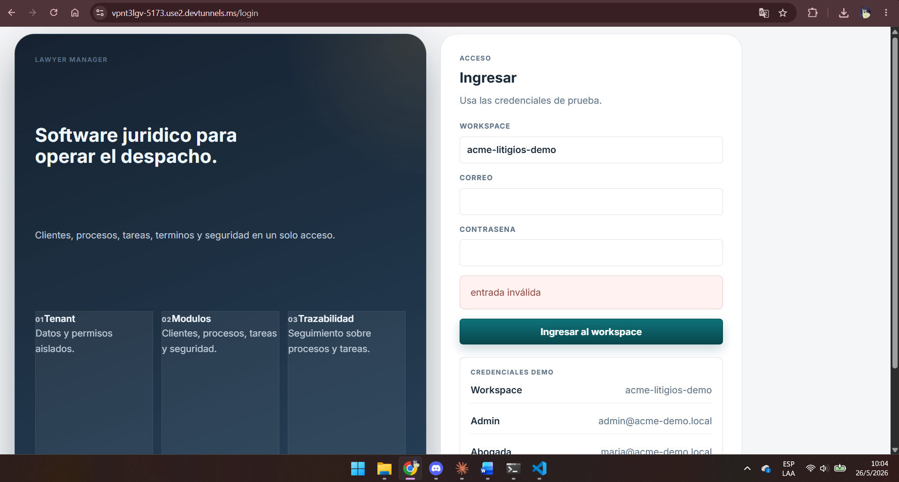
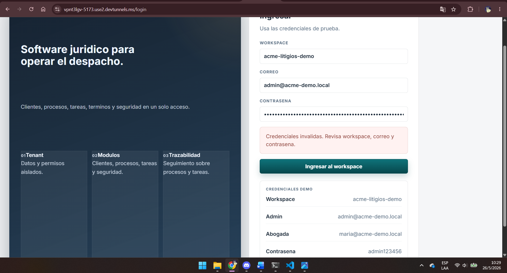
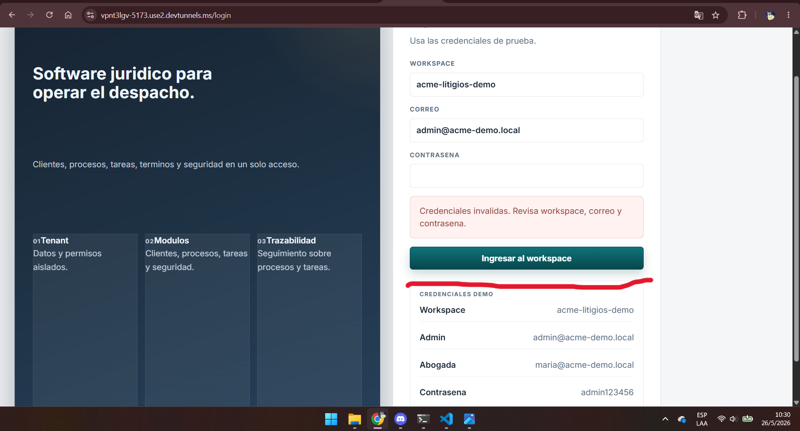
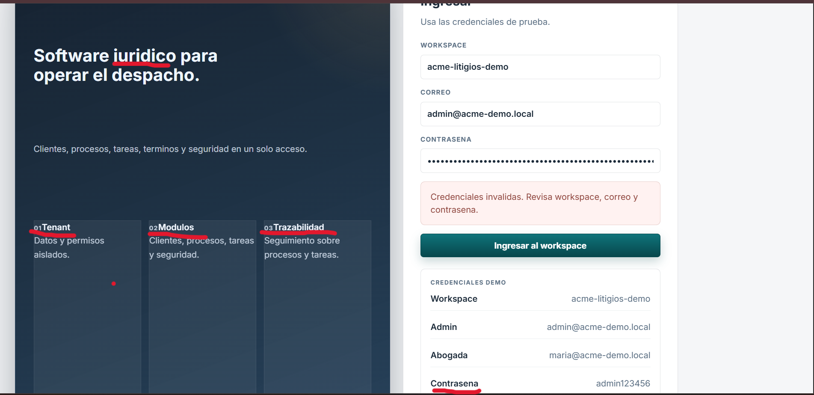
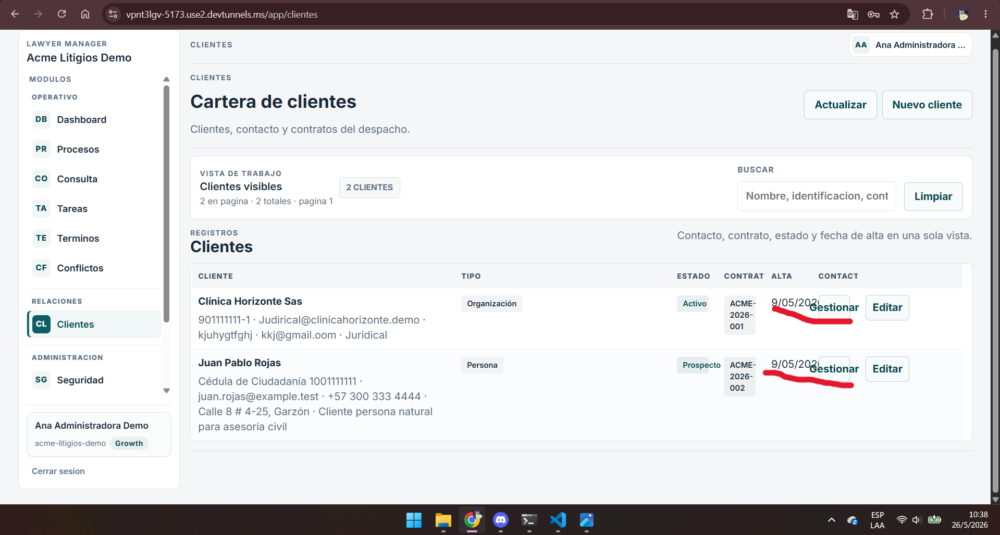
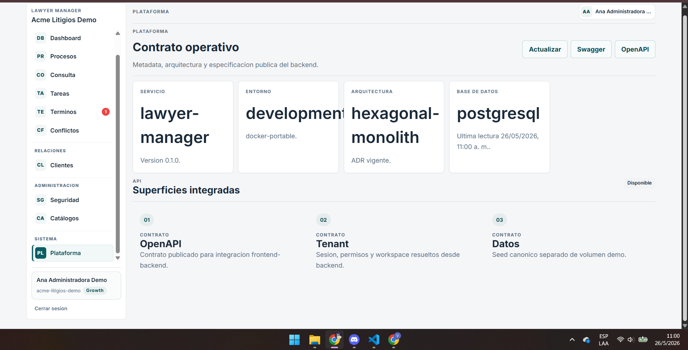
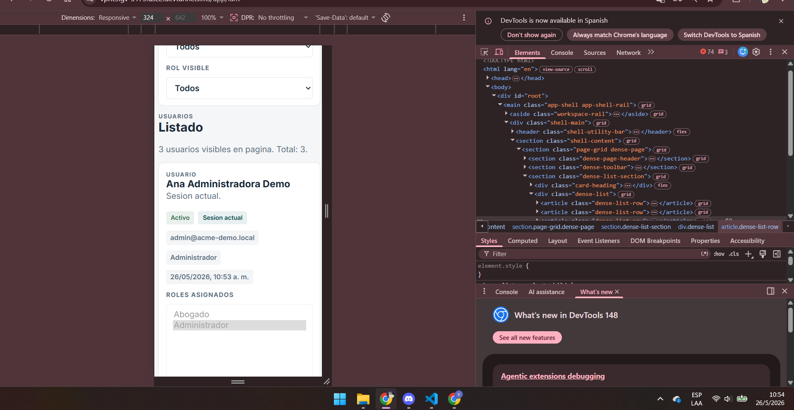

# Presentación — Documentación de Problemas de Usuario en Frontend

## Título de la actividad
Identificación y documentación de problemas de usuario en la interfaz Frontend

---

## Presentado por
Valery Trujillo

---

## Instructor
Jesús Ariel

---

## Institución
SENA

---

## Fecha
26 de mayo de 2026

---

# Objetivo General

Identificar y documentar posibles errores, vulnerabilidades y problemas de usabilidad presentes en la pantalla de login de una aplicación frontend.

---

## Login-Obeservaciones

# Problema 1 — # Problema — Mensajes de error con baja visibilidad visual

El mensaje de error presentado en el formulario de login no posee suficiente separación visual respecto a los demás elementos, lo que puede dificultar su identificación y comprensión por parte del usuario.ñ

---

# Problema 2 — Ausencia de recuperación de contraseña

La pantalla de login no cuenta con una opción para recuperar la contraseña en caso de olvido, dificultando el acceso nuevamente al sistema por parte del usuario.

---

# Problema 3 — Diseño visual y estructura de la interfaz

La interfaz presenta problemas de organización visual, inconsistencias en tamaños de texto y errores ortográficos, lo que afecta la legibilidad y la apariencia general del sistema.

---

# Problema 4 — Mala distribución y desbordamiento de información

La interfaz presenta problemas de distribución en la tabla de clientes, ya que algunos datos como las fechas se sobreponen o quedan demasiado cerca de otros elementos, afectando la legibilidad y la organización visual del sistema.

---

# Problema 5 — Diseño responsive 

La interfaz presenta problemas de adaptación en resoluciones móviles, ya que algunos elementos se desorganizan, se ven demasiado ajustados y dificultan la lectura e interacción del usuario en pantallas pequeñas.

